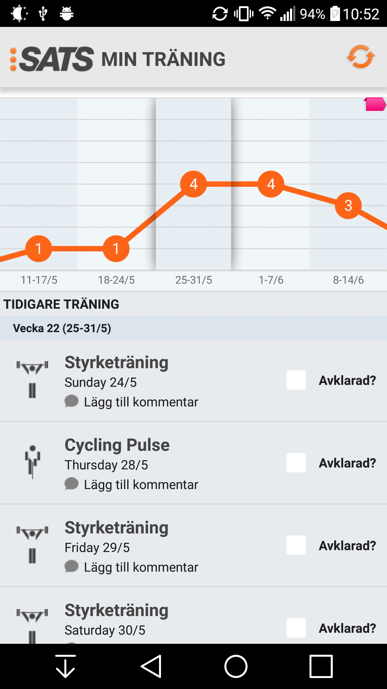
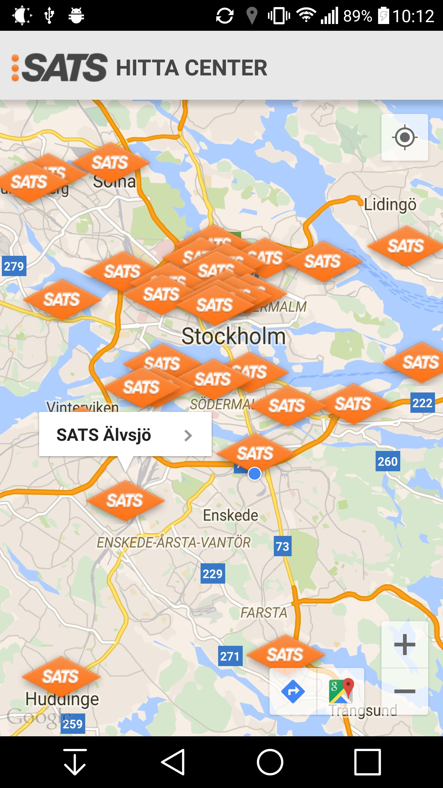
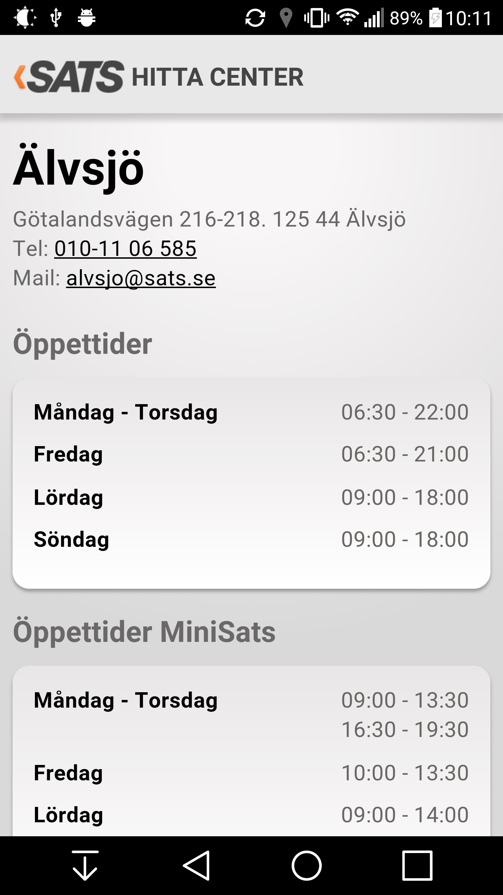

#Clone of official [SATS-App](https://play.google.com/store/apps/details?id=com.sats.sats)
###Android Course project done in a group of 5.
We were given the task to replicate the official [SATS Training](https://play.google.com/store/apps/details?id=com.sats.sats) app based on mocks and specifications provided to us.

###**Main parts where I contributed:**
* Fine-tweaking the UI to make it match the mocks we were given without creating overly nested xml layout files.
* [Realm Mobile Database](http://www.realm.io) integration and bug-fixing.
* Handling git version control setup and support for our team.

###**Libraries Used:**
* Realm
* Ion
* StickyListHeaders
* Greenrobot Eventbus
* Google Play Services

###**Main features:**

######Detailed UI to show both past and future booked classes.  
Graph is showing the number of classes for each week. It is scrollable both left/right and if clicked will scroll the list below to the corresponding week.  

Data is downloaded from SATS Public REST-API combined with dummy data from our own server. Then stored locally with Realm and updated when needed based on HTTP headers automatically through Ion when new requests are made.  

  
 

######Map to look up nearby Sats Training Centers
  
 

#####Webview to show Training Center details
